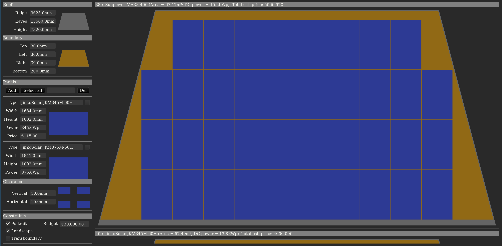

# solplan-rust

Just a little Rust exercise. What the app does is generating plans for placing solar panels on a roof.

## Disclaimer

This was more of a Rust exercise then an actual usable application. It is `garbage-in = garbage-out`. The input data is just there for convenience/as a placeholder. If you actually want to use the application, please check the inputs for yourself, especially the panel types.

